# Hi there, I'm Janis Hutz 👋

  
   

_______
**Coding Time Stats**

  

## Own git instance
Many of the projects I currently work on are private and public repos on my [personal git](https://git.janishutz.com/janishutz)! There are also some nice utilities available there!

## Links
- Website: https://janishutz.com
- Blog: https://blog.janishutz.com
- Store: https://store.janishutz.com
- Accounts: https://account.janishutz.com
- Personal Git: https://git.janishutz.com/janishutz

    

